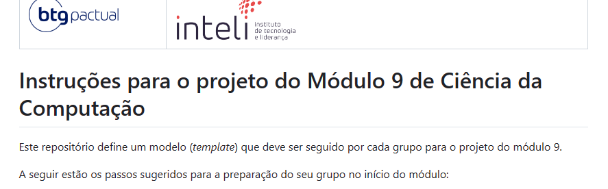
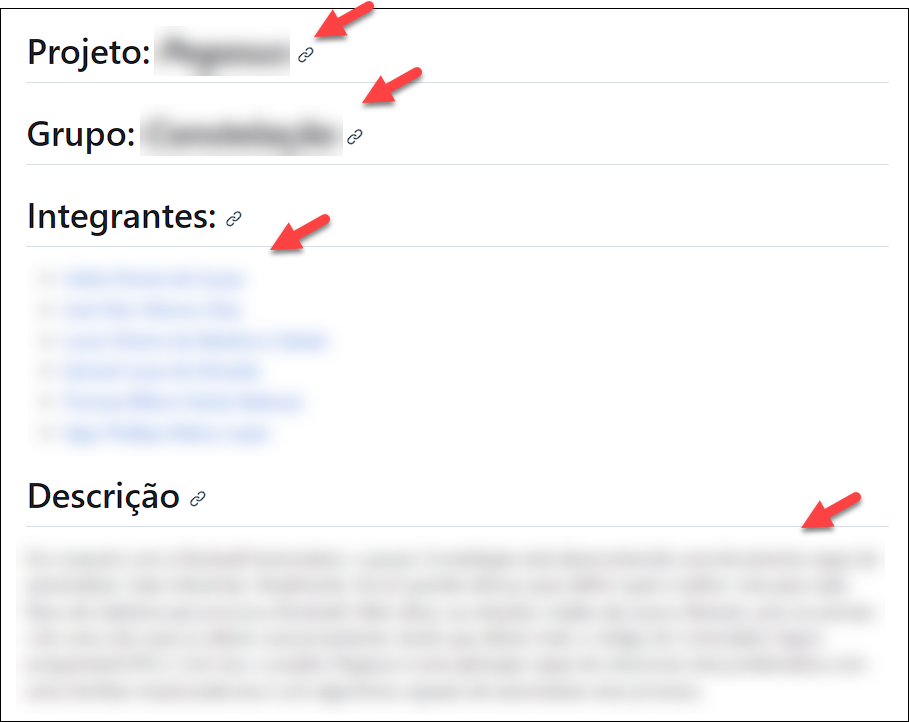
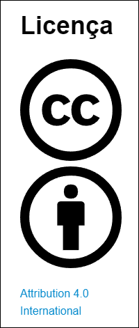
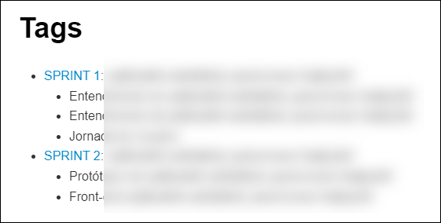
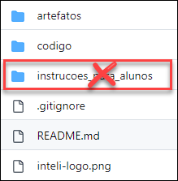
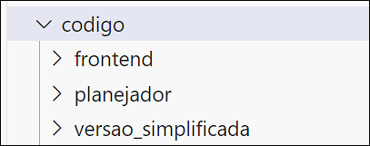

# Checklist para a entrega do projeto 

**Nome do projeto:** Algoritmo de otimização para alocação e distribuição de equipes de técnicos

## 1. No arquivo README.md

- [ ] (a) Os logos do parceiro e do Inteli estão no topo da página.

---

- [ ] (b) O texto com as instruções iniciais para os alunos foi removido.

---

- [ ] (c) Os campos projeto, grupo e integrantes estão preenchidos corretamente.

- [ ] (d) O campo descrição contém um resumo do problema e da solução desenvolvida.

---

- [ ] (e) Contém instruções para desenvolvedores utilizarem o código do repositório.

---

- [ ] (f) Menciona explicitamente que a licença do projeto é a "Application 4.0 International".
- [ ] (g) O nome da licença está com link para https://creativecommons.org/licenses/by/4.0/?ref=chooser-v1
- [ ] (h) Apresenta o logo https://creativecommons.org/wp-content/themes/vocabulary-theme/vocabulary/svg/cc/icons/cc-icons.svg#cc-logo
- [ ] (i) Apresenta o logo https://creativecommons.org/wp-content/themes/vocabulary-theme/vocabulary/svg/cc/icons/cc-icons.svg#cc-by

---

- [ ] (j) Há uma lista das tags, com a enumeração dos artefatos de cada tag.

## 2. Organização das pastas e arquivos

- [ ] (a) A raiz do repositório contém apenas as pastas para **artefatos** e **codigo** e os arquivos **README.md**, **.gitignore** e **inteli-logo.png** (a pasta **instrucoes_para_alunos** deve ser removida).

## 3. Na pasta /artefatos

- [ ] (a) Há apenas arquivos no formato markdown (.md) e a pasta de imagens (img).
- [ ] (b) Todos os links dentro dos arquivos no formato markdown (.md) estão funcionando.
- [ ] (c) Todas as imagens estão aparecendo corretamente dentro dos arquivos no formato markdown (.md).

## 4. Na pasta /codigo

- [ ] (a) Há apenas pastas, onde cada pasta corresponde a um item de software do projeto (a figura abaixo mostra um exemplo onde o projeto tem 3 itens de software).

# Preparando seu Projeto de Aprendizado por Reforço para Deploy

Ao desenvolver seu projeto no Google COLAB, é essencial pensar na preparação para o deploy desde o início. Vamos seguir algumas etapas importantes que ajudarão a estruturar seu projeto de acordo com as melhores práticas de MLOps. Aqui está o que você precisa fazer:

## I. **Estruture seu Projeto**

Uma boa estrutura é o ponto de partida para qualquer projeto de qualidade. Organize seu projeto da seguinte maneira:

- `data/`: Para seus conjuntos de dados ou scripts de acesso a dados.
- `models/`: Onde seus modelos treinados ficarão armazenados.
- `notebooks/`: Para seus Jupyter notebooks de experimentos.
- `src/`: Seu código fonte, incluindo ambientes personalizados, implementações dos agentes e utilitários.
- `tests/`: Testes unitários e de integração.
- Além disso, não se esqueça do `requirements.txt`, `Dockerfile` e `README.md`.

## II. **Use Controle de Versão**

Adote o Git para controle de versão. Isso facilitará o gerenciamento de mudanças e colaboração no seu projeto. Crie um repositório no GitHub ou GitLab e utilize o `.gitignore` para evitar arquivos desnecessários no repositório.

## III. **Virtualização e Containerização**

- **Ambiente Virtual:** Crie um ambiente virtual para isolar as dependências do projeto.
- **Containerização:** Prepare um `Dockerfile` que detalha como construir uma imagem Docker do seu projeto. Isso garante consistência entre diferentes ambientes.

## IV. **Automatize os Testes**

Implemente testes unitários e de integração para funções críticas e componentes do agente. Utilize `pytest` e integre com ferramentas de CI para rodar testes automaticamente.

## V. **Integração e Entrega Contínuas (CI/CD)**

Configure um pipeline de CI/CD com GitHub Actions, GitLab CI/CD ou Jenkins. Isso deve incluir etapas para instalar dependências, executar testes e construir/publicar a imagem Docker.

## VI. **Monitoramento e Logging**

Implemente logging no seu código para monitorar o desempenho. Considere ferramentas de monitoramento como Prometheus ou Grafana para acompanhar o modelo em produção.

## VII. **Documentação**

Escreva uma documentação detalhada no `README.md`, descrevendo o projeto, configuração, execução e detalhes sobre CI/CD.

## VIII. **Checklist de Pré-Deploy**

Antes do deploy, confirme que:

- [ ] O código está limpo e refatorado.
- [ ] Todos os testes automatizados estão passando.
- [ ] A documentação está completa.
- [ ] A imagem Docker foi construída e testada localmente.
- [ ] O pipeline de CI/CD está configurado e operante.

Seguir estas etapas não só facilitará o deploy do seu projeto, mas também ajudará a garantir que ele seja fácil de integrar, testar e manter. Boa sorte com seu projeto de Aprendizado por Reforço!

# Pontos Importantes

Olá pessoal,

Aqui estão alguns pontos importantes a serem observados:

## A. Prazo para Repositório do GitHub
Certifiquem-se de que, **antes do final da primeira semana da Sprint 5**, vocês já tenham entrado em contato com o professor orientador para obter o repositório do GitHub onde deverão submeter seus projetos completos.

## B. Qualidade e Funcionamento do Código
É fundamental que todo o código esteja funcionando de maneira adequada. Isso significa que ele deve ser rigorosamente testado, limpo e refatorado, conforme o desenvolvimento foi progredindo. A qualidade e a clareza do código são tão importantes quanto a sua funcionalidade.

## C. Atualizações no Artigo
O artigo deve estar completo, com todas as correções e atualizações implementadas. Isso inclui a seção de Introdução que foi revista, bem como qualquer outro tópico do artigo (metodologia etc.) que tenha recebido feedback antes ou durante a Sprint. É crucial que o documento final reflita todas essas modificações.

---

Lembrem-se de que o cumprimento desses pontos é essencial para o sucesso do projeto. Estamos na reta final, e este é o momento de garantir que todos os detalhes estejam perfeitos. Contem comigo para o que precisarem.

**Boa sorte!**
